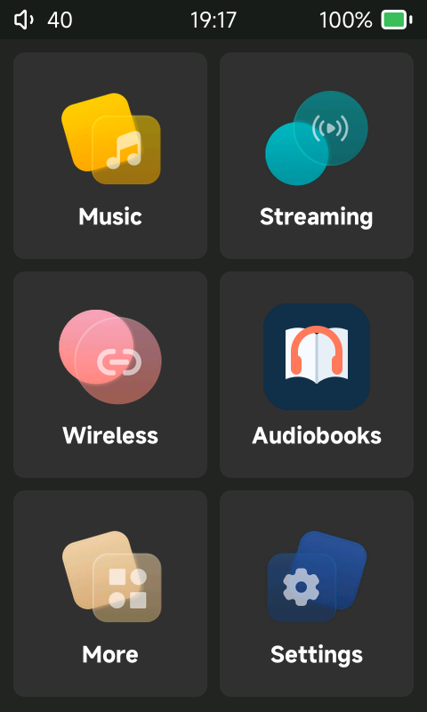
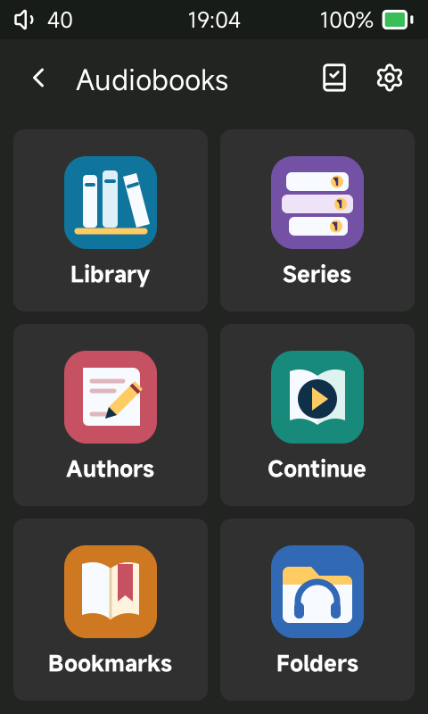
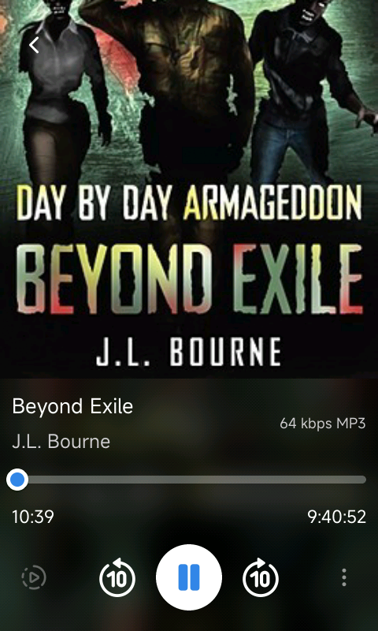

# Sonix Player

> **Audiobook-focused fork:** this repository is the public-preview successor to
> the stock-based HiBy R1 Audiobook Mod. See
> [AUDIOBOOK_EDITION.md](AUDIOBOOK_EDITION.md) for its goals, fork-specific
> changes, upstream relationship, and release status. The original Sonix Player
> documentation continues below. Developers can automate an ADB-enabled R1 with
> the local test interface described in [DEVICE_TESTING.md](DEVICE_TESTING.md).

A replacement player for the **HiBy R3 Pro II** and the **HiBy R1**, written on
LVGL.

The downloadable Audiobook Edition firmware currently targets the original
HiBy R1 only. It is not an image for the R1 MIDI or R3 Pro II.

## Install the R1 release

1. Download `r1.upt` from the
   [latest release](https://github.com/yetisoldier/sonix-player/releases/latest).
2. Charge the R1 above 30% and keep a copy of HiBy's stock R1 firmware for
   recovery.
3. Put music in `/Music` and audiobooks in `/Audiobooks` on a microSD card.
4. Copy `r1.upt` to the root of that card.
5. On Sonix Player, open **Settings > System > Update firmware > From SD
   card**. From stock firmware, use its SD-card firmware update command.
6. Let the update complete and reboot. Do not remove power or the card while
   it is flashing.
7. Open Music or Audiobooks and run its library scan after adding or replacing
   a card.

The operation is reversible by flashing the official HiBy R1 firmware. ADB is
off unless enabled in Developer options; its saved switch can be used across
reboots while developing.

## Screenshots

| Home | Audiobook views |
|---|---|
|  |  |



## What this fork changes

This project is based on
[Jepl4r/sonix-player](https://github.com/Jepl4r/sonix-player). Upstream Sonix
Player already provides an excellent base: separate Music and Audiobooks
libraries, multipart books, embedded chapters, authors and series, playback
speed, configurable skips, a sleep timer, Bluetooth, USB audio, and USB
storage. This fork preserves those features and concentrates on audiobook
workflow and HiBy R1 reliability.

It is also the next-generation companion to the stock-based
[HiBy R1 Audiobook Mod](https://github.com/yetisoldier/Hiby-R1-Audiobook-Mod).
Use that project to keep the familiar HiBy interface. Use this one for deeper
integration, a purpose-built audiobook interface, and a player that can be
changed and tested at source level.

| Area | Upstream Sonix Player | Audiobook Edition |
|---|---|---|
| Audiobook home | Library, author, series, continue and finished browsing | Six direct views: Library, Series, Authors, Continue, Bookmarks and Folders, with distinct icons |
| Resume | Per-book position and multipart resume | Background checkpoints, forced saves on important transitions, direct part resume, completion reset, and card-swap protection |
| Bookmarks | Playback position only | User-created positions collected in a global Bookmarks view, with direct jump and deletion |
| Book information | Core tags and artwork | Publisher summary/description on the book page, plus title, author, series and artwork |
| Folder browsing | Books are discovered recursively | Indexed `Audiobooks/Author/Series/Book` hierarchy that opens quickly without rescanning the card for every tap |
| R1 validation | Host and device operation | Repeatable audiobook smoke tests plus an ADB UI-control channel for taps, swipes, wake, status and screenshots |

### Audiobook behavior

- Audiobooks live under `/Audiobooks` and remain separate from `/Music`.
- A single audio file can be a book. Files sharing one book folder or album
  form a multipart book in natural track order, including `CD 1` and `Disc 2`
  folders.
- Resume is stored per book and returns directly to the saved file and time.
  Checkpoints are written off the UI thread so a slow SD card does not stall
  touch or physical controls.
- Pause, seek, stop, card removal and shutdown flush the latest position. A
  queued write is tied to its original card database and cannot leak into a
  replacement card.
- Finishing within 45 seconds of the final part marks a book complete. Starting
  that completed book again begins at the start.
- Manual bookmarks supplement automatic resume and remain available from the
  audiobook home screen.
- Book descriptions are read from common MP4 and ID3 summary or comment
  metadata. Missing author or series information falls back to the folder
  hierarchy; books without a series continue to work normally.

### Reliability changes

- Audio completion signals the controller immediately for more reliable
  multipart transitions instead of waiting for the UI progress timer.
- Resume checkpoints and catalog work avoid blocking the LVGL interface.
- Bluetooth pairing reconciles a successfully saved bond even when BlueZ's
  pairing call times out after the earbuds have already disconnected.
- Suspend and wake restore the real output route and DAC level even when the
  kernel rejects a suspend attempt.
- The R1 touchscreen loader is normalized and audited during packaging. The
  player identifies the direct-touch panel and physical button devices by
  capability and kernel name instead of assuming fixed `/dev/input/eventN`
  numbers. This was tested with the real panel deliberately moved from
  `event1` to `event4`.
- Real-time CPU use is bounded so a faulty worker cannot indefinitely starve
  the single-core UI and kernel tasks.

See [AUDIOBOOK_EDITION.md](AUDIOBOOK_EDITION.md) for project goals and release
status, [FEATURES.md](FEATURES.md) for the complete inherited and fork feature
set, and [DEVICE_TESTING.md](DEVICE_TESTING.md) for ADB-based device automation.

The original build and architecture documentation continues below.

## Supported players

One binary runs on both. It reads which player it is on from
`system-info.json` at startup, and the firmware packer writes a different one
into each image.

| | HiBy R3 Pro II | HiBy R1 |
|---|---|---|
| panel | 480x720 | 480x800 |
| DAC | two Cirrus Logic CS43198 | one Cirrus Logic CS43131 |
| headphone outputs | 3.5 mm, 4.4 mm balanced | 3.5 mm |
| DAC controls | digital filters, DRE, NOS | digital filters |
| touch | Goodix gt9xx, patched for multitouch | Hynitron CST8xx, patched for two fingers |
| double tap to wake | yes | no |
| buttons | volume on the left flank, playback on the right | all on the right flank, one skip key |
| firmware image | `r3proii.upt` | `r1.upt` |

Each player only looks for its own image, and never offers the other's: the
recovery system does not check what it is given.

There are two builds from one tree:

| | binary | runs on |
|---|---|---|
| **host** | `sonix_player_host` | your PC, in an SDL window |
| **target** | `sonix_player` | the device |

---

## Building for the host

The simulator draws the real interface in an SDL window, using the same source
as the device. Most work happens here.

### What you need

Compiler, make, git, and four libraries.

**Fedora**

```bash
sudo dnf install gcc gcc-c++ make git pkgconf-pkg-config \
                 SDL2-devel freetype-devel opusfile-devel \
                 wavpack-devel alsa-lib-devel
```

**Debian / Ubuntu**

```bash
sudo apt install build-essential git pkg-config \
                 libsdl2-dev libfreetype-dev libopusfile-dev \
                 libwavpack-dev libasound2-dev
```

**Arch**

```bash
sudo pacman -S base-devel git sdl2 freetype2 opusfile wavpack alsa-lib
```

`opusfile` pulls in `opus` and `libogg` by itself.

### Build

```bash
make host -j$(nproc)
```

### Resources

The player reads its language files, its streaming keys and some of its gui assets
from a resource tree:

```
sonix_player_host
usr/
└── resource/
    └── sonix/
        ├── language/                    the 7 .ini files
        ├── components/
        │   ├── streaming-keys.bin       Tidal / Qobuz / Podcast Index / Last.fm keys, sealed - see "Streaming keys" below.
        │   └── system-info.json         its device-name picks the player the simulator plays
        └── gui/                         some of the .png assets the UI loads at runtime - the rest are inside the binary.
```

The easiest way to get one is to copy `usr/resource/` out of
`sonix-packer/assets/R3PII/` or `sonix-packer/assets/R1/` into `usr/resource/`
next to `sonix_player_host`: the language files, the fonts, the images and the
`system-info.json` of that player come with it.

Without the language files the interface draws raw tags instead of words, and says so on the first line of the log. Without `streaming-keys.bin` everything works except Tidal, Qobuz, podcasts and Last.fm. The simulator also reads a plain `streaming-keys.ini` in the same folder.

Fonts are looked for in `usr/resource/sonix/fonts` first and fall back to
`assets/fonts` in the repo, so a tree without a resource folder still has text.

### Run

```bash
./sonix_player_host
```

The window is the panel of the player named in `system-info.json`: 480x720 for
the R3 Pro II, 480x800 for the R1, and 480x720 when the file is missing. The
mouse is the finger, and dragging scrolls.

`SONIX_PANEL=480x800` opens the window at a given size whatever the file says.
The rest of the model (buttons, DAC, update file) still follows the file.

The folder that stands in for the memory card is the **documents folder**,
found from the desktop's own XDG setting. Point it elsewhere with:

```bash
SONIX_SD_ROOT=/path/to/a/card ./sonix_player_host
```

Music goes in there, and so does everything the player writes: the index, the
cover cache, the playlists.

### Keyboard

The device's buttons are on the keyboard:

| key | R3 Pro II | R1 |
|---|---|---|
| `p` | power — a tap toggles the screen, held opens the power menu | same |
| `u` | volume up | same |
| `i` | volume down | same |
| `b` | previous track | the skip key: next track |
| `n` | play / pause | same |
| `m` | next track | previous track (no such key on the R1) |


### Other environment variables

| variable | what it does |
|---|---|
| `SONIX_SD_ROOT` | the folder standing in for the card |
| `SONIX_PANEL` | the window size, e.g. `480x800` |
| `SONIX_CONFIG` | where the settings file lives |
| `SONIX_EBOOK_CONFIG` | the ebook reader's own settings file |
| `SONIX_LANG_DIR` | the language directory, instead of the resource tree |
| `SONIX_LOG` | write the log to a file |
| `SONIX_BATTERY_CAPACITY`, `SONIX_BATTERY_STATUS` | two files to fake a battery |
| `SONIX_NO_MOUNT`, `SONIX_NO_SYSSERVER` | leave the host's own system alone |


## Building for the device

### What you need

The host requirements above, plus `wget`, `texinfo`, `bison`, `flex` and about
2 GB of disk: the first target build compiles a MIPS cross toolchain from
source.

### Build

```bash
make target -j$(nproc)
```

The first run takes a while and does four things by itself:

1. builds the Rockbox MIPS toolchain into `rockbox-toolchain/`
2. downloads and cross-builds FreeType, static, into `freetype-target/`
3. downloads and cross-builds libogg, libopus, opusfile and libwavpack, static,
   into `audio-target/`
4. compiles and links `sonix_player`, and builds `sonix_launch` (see below)

Steps 1 to 3 happen once. Later builds go straight to step 4.

On WSL, keep the build tree and toolchain in the Linux filesystem (for example
under `~/src`) rather than `/mnt/c`. Cross-toolchain and dependency tracking
can be dramatically slower on the Windows-mounted filesystem. The finished
binary can be copied back into the repository before packaging.

Everything the device does not already carry is linked statically, so the
result is one file to copy across with nothing to install beside it. The same
file goes into both images.

### The ABI check

The link is followed by a `readelf` pass that fails the build if the binary
asks for a glibc symbol newer than 2.22, the version both players carry.

This is not decoration. A binary that asks for a newer symbol links without a
word and then refuses to start, and the device reboots as soon as the player
exits - so the only symptom on the device is a boot loop.

### sonix_launch

A 2 KB static binary with no libc (`launcher/sonix_launch.c`). The launcher
script execs it, and it runs the player as its child and does `sleep 1; reboot`
when the player exits - what the rest of the script would do, without a shell
sitting in memory for the whole session.


## Creating the firmware image

The packer looks only next to itself:

```
sonix-packer/
├── sonix_firmware_packer.sh
├── r3proii_original.upt     the stock firmware of the R3 Pro II, from HiBy
├── r1_original.upt          the stock firmware of the R1, from HiBy
├── sonix_player             the binary from `make target`
├── sonix_launch             also from `make target`; optional
└── assets/
    ├── R3PII/               the overlay for the R3 Pro II
    └── R1/                  the overlay for the R1
```

It builds one image for each stock firmware it finds. With only one of the two
`.upt` files next to it, it builds that player's image and says it skipped the
other.

Each model has a complete overlay of its own and nothing is shared.

An overlay mirrors the rootfs from its root, so a file goes to the path it has
inside the folder. That is how the resource tree gets installed:

```
assets/R3PII/                           (and assets/R1/, the same shape)
├── etc/                             boot logos at the panel's size, D-Bus policy, certificates, S80_bt_init
├── usr/
│   ├── bin/                         bluealsa
│   ├── lib/                         the bluealsa ALSA plugin
│   ├── resource/
│   │   └── sonix/
│   │       ├── language/            the 8 .ini files
│   │       ├── components/
│   │       │   ├── streaming-keys.bin   Tidal / Qobuz / Podcast Index / Last.fm keys, sealed - see "Streaming keys" below.
│   │       │   ├── system-info.json     required: names the player, and the packer writes to it
│   │       │   └── GB*-Database.dat     the Game Boy ROM databases
│   │       ├── fonts/               default.otf, bold.otf, then korean, thai and arabic .otf, each with a -bold
│   │       └── gui/                 some of the .png assets the UI loads at runtime - the rest are inside the binary.
│   └── share/web/                   icons and images for the Wi-Fi transfer page                        
└── module_driver/                   the patched touch driver and its load script
```

`system-info.json` has to be there, and its `device-name` has to be the model
the folder is for: `HiBy R3 Pro II` in `R3PII/`, `HiBy R1` in `R1/`. The packer
checks it, writes the build stamp into the `build_version` key, and stops if
either is wrong. An image carrying the other player's name would offer that
player's update to a device that cannot survive it.

### Streaming keys

Tidal, Qobuz, Podcast Index and Last.fm need application keys, and they are
not in this repository: provide your own (for Last.fm, an API account from
last.fm/api). They go into the image sealed, so that unpacking
it does not hand them out as a text file.

1. Copy `sonix-player/streaming-keys.ini.example` to
   `sonix-player/streaming-keys.ini` and fill it in.
2. Seal it into both assets trees:
   ```bash
   cd sonix-player
   python3 tools/seal_streamkeys.py seal
   ```
   The first run creates `streaming-keys.key`, the key that seals them. Keep
   it: every later `seal` reuses it.
3. Build the player (`make target`). The Makefile compiles the key into it, so
   only this build opens the `streaming-keys.bin` sealed with it. A new key
   means a new build.

`streaming-keys.ini`, `streaming-keys.key` and `streaming-keys.bin` are all
ignored by git. The packer leaves out a `streaming-keys.ini` found in the
assets and says so. `python3 tools/seal_streamkeys.py open <file>` prints what
a `.bin` holds.

This keeps the keys out of plain sight, not out of reach: the key is inside
`sonix_player`, and whoever takes the binary apart can get them back.

### What it needs installed

```bash
# Debian / Ubuntu
sudo apt install p7zip-full squashfs-tools genisoimage

# Fedora
sudo dnf install p7zip squashfs-tools genisoimage
```

### Build

```bash
./sonix_firmware_packer.sh
```

It runs through without asking anything, once for each model:

1. unpacks the `.upt`, joins the rootfs chunks and extracts the squashfs
2. deletes `usr/bin/hiby_player` and installs `usr/bin/sonix_player`
3. renames `hiby_player.sh` to `sonix_player.sh` and rewrites the name inside it
4. points `etc/init.d/S92_03_start_music_player` at the new launcher script
5. copies `assets/<model>/` over the rootfs, then installs
   `usr/bin/sonix_launch` and has the launcher script exec it (skipped with a warning
   if it is not there)
6. deletes the stock interface's own resources - `litegui`, `layout`, `str`,
   `fonts`.
7. checks the `device-name` in `system-info.json` and writes the build stamp
   into it
8. repacks the squashfs, splits it into 512 KB chunks and rebuilds the md5
   chain the recovery kernel checks
9. writes `r3proii.upt` or `r1.upt`

The kernel is carried across untouched, size and md5 copied from the original
rather than recomputed.

### Patches

They go in **before** the repack, and the easiest way is through
the overlay - any other file need to be in the respective folder mirroring the rootfs structure.

### Flashing

1. Copy the image for your player to the **root of the microSD card**:
   `r3proii.upt` for the R3 Pro II, `r1.upt` for the R1. Never the other one.
2. Insert the SD card into the player.
3. Start the update:
   - **from the stock firmware** - use its firmware update from the microSD
     card.
   - **from Sonix Player** - Settings > System > Update firmware > From SD
     card. *Via internet* downloads the right image from the latest release by
     itself.
4. Let it flash - it will say "Upgrading..." then "Succeeded" and reboot by itself.

> It is recommended to **charge above 30%** first. 
**Recovery from a failed flash:** If something goes wrong, you can always restore by flashing the original stock firmware from HiBy's website using the same procedure.


## Generated files

Three files in the tree are produced by a script and committed, so an ordinary
build needs no Python at all. Re-run the script only when its input changes.

| generated | from | script |
|---|---|---|
| `src/gui/shell/icons.c`, `icons.h` | `assets/icons/*.svg`, `*.png` | `tools/svg_to_lvgl.py` |
| `src/system/net/webpage.h` | `web/index.html`, `web/icons`, `web/img` | `tools/web_to_c.py` |

```bash
pip install cairosvg pillow
python3 tools/svg_to_lvgl.py

python3 tools/web_to_c.py
```


## Source code tree

```
sonix-player/
│
├── sonix-packer/
│   ├── assets/
│   │   ├── R3PII/                   the R3 Pro II overlay
│   │   │   ├── etc/                 boot logos (480x720), sonix-player.conf, cert.pem, modified S80_bt_init
│   │   │   ├── module_driver/       patched gt9xx_touch.ko, gt9xx_touch.sh and leds_sgm31324_add.sh with 3 added LED registers
│   │   │   └── usr/                 bluealsa 4.3.1, resources required by Sonix Player
│   │   └── R1/                      the R1 overlay
│   │       ├── etc/                 boot logos (480x800), sonix-player.conf, cert.pem, modified S80_bt_init
│   │       ├── module_driver/       patched cst8xx_touch.ko and cst8xx_touch.sh
│   │       └── usr/                 bluealsa 4.3.1, resources required by Sonix Player
│   │                                
│   └── sonix_firmware_packer.sh     
│
│
├── sonix-player/                    
│   ├── assets/                      
│   │   ├── gui/                     some of the .png assets the UI loads at runtime - the rest are inside the binary.
│   │   ├── fonts/ 					 the faces: default, bold, Korean (Hangul from Pretendard, OFL), Thai, Arabic
│   │   └── icons/                   196 SVGs and PNGs, baked into src/gui/shell/icons.c
│   │   
│   │
│   ├── launcher/                    sonix_launch.c: runs the player, reboots when it exits
│   │
│   ├── rockboxdev/                  builds the MIPS cross toolchain, first `make target` only
│   │   ├── toolchain-patches/       three patches gcc and binutils needed on a modern host
│   │   └── rockboxdev.sh
│   │
│   ├── src/
│   │   ├── gb/                      Gearboy, upstream and untouched
│   │   │   ├── core/                78 files: the emulator itself
│   │   │   └── miniz/               reads a ROM straight out of a .zip
│   │   │
│   │   ├── gui/                     
│   │   │   ├── audio/               EQ, PEQ, MSEB and the DAC page
│   │   │   ├── bluetooth/           pairing, codec, AirPods, receiver mode
│   │   │   ├── ebook/               EPUB reader: pages, shelf, bar, bookmarks, themes
│   │   │   ├── fonts/               the lv_font_t objects FreeType fills in at startup
│   │   │   ├── gearboy/             game list, screen and button pad
│   │   │   ├── library/             file browser, media lists, playlists, search
│   │   │   ├── nowplaying/          player screen, cover art, cover flow, waveform, queue
│   │   │   ├── settings/            26 files, one page each
│   │   │   ├── shell/               40 files: theme, screen switcher, status bar, control
│   │   │   │                        centre, keyboard, popups, toasts, settings rows, icons.c
│   │   │   ├── streaming/           Tidal, Qobuz, podcast and radio pages
│   │   │   └── wireless/            Wi-Fi, file transfer, AirPlay, DLNA, SonixLink
│   │   │
│   │   ├── system/                  
│   │   │   ├── audio/               ALSA, volume, filter chain, USB audio, headset
│   │   │   ├── bluetooth/           the whole stack, run by the player and not by the firmware
│   │   │   ├── core/                config, language, logging, paths, utils
│   │   │   ├── db/                  SQLite
│   │   │   ├── decode/              one file per format, plus the dispatcher and CUE handling
│   │   │   ├── device/              power, screen, buttons, USB, storage, ADB, firmware, LED
│   │   │   ├── ebook/               EPUB parsing: zip, XML, XHTML, CSS, OPF, arenas
│   │   │   ├── gearboy/             the emulator's glue: input, ROM database, save states
│   │   │   ├── image/               JPEG and PNG decoder
│   │   │   ├── input/               key mapping
│   │   │   ├── library/             index, tag reading, cover art, playlists, audiobooks
│   │   │   ├── net/                 HTTP, TLS, HLS, mDNS, transfer page
│   │   │   ├── playback/            queue, device state, audiobooks, sleep timers
│   │   │   ├── remote/              AirPlay, DLNA, SonixLink
│   │   │   └── streaming/           service clients and their caches
│   │   │
│   │   └── main.c                   entry point: display, input, and the startup order
│   │
│   ├── tools/                       generators, and the multitouch patches for the two touch drivers
│   │
│   ├── web/                         Wi-Fi transfer page, source of src/system/net/webpage.h
│   │   ├── icons/                   26 Lucide glyphs, inlined as <symbol>
│   │   ├── img/                     favicon-web.png, logo-web.png
│   │   └── index.html               the template
│   │
│   ├── generate_compile_commands.py 
│   ├── lv_conf.h                    
│   └── Makefile                     
│
├── FEATURES.md                      
├── LICENSE                          
├── PATCHES.md                       
└── README.md
```


## Special thanks to:
[@Tartarus6](https://github.com/Tartarus6)

[@noisetta](https://github.com/noisetta)

[@endgame47](https://github.com/endgame47)

[@hkhrithik007](https://github.com/hkhrithik007)

and all the members of this fantastic community!!
