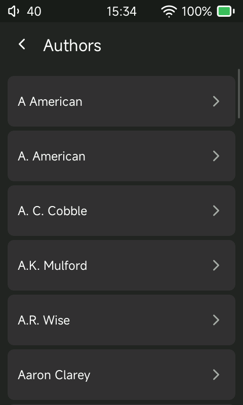
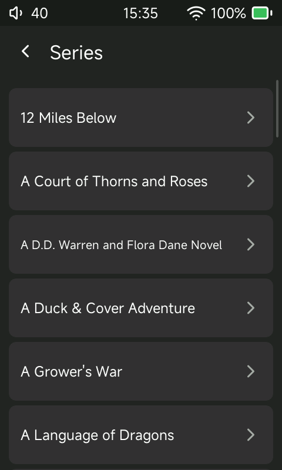

# Sonix Audiobooks

An audiobook-focused fork of [Sonix Player](https://github.com/Jepl4r/sonix-player) for the original **HiBy R1**.

Sonix Audiobooks keeps Sonix Player's full local-music experience, but makes audiobooks a first-class part of the device: they have their own library, their own browsing views, reliable per-book resume, bookmarks, descriptions, chapters, and a Now Playing screen designed for long-form listening.

This is a replacement firmware, not an add-on for stock HiBy firmware. It is fully reversible by installing HiBy's official R1 firmware again.

> **Compatibility:** The public Sonix Audiobooks release currently supports the original HiBy R1 only. Do not install it on an R1 MIDI, R3 Pro II, or another HiBy player.

## What makes this fork different

Sonix Audiobooks is built on the excellent Sonix Player base and retains its music library, Bluetooth, USB audio, USB storage, wireless receiver, equalizer, MSEB, playlists, sleep timer, and ordinary playback controls.

The fork adds and hardens the parts that matter most when the R1 is used as an audiobook player:

- A dedicated Audiobooks tile and six direct views: **Library**, **Series**, **Authors**, **Continue**, **Bookmarks**, and **Folders**.
- Separate `/Audiobooks` and `/Music` libraries, so book files do not mix into Music browsing.
- Per-book resume for single-file and multipart books, including direct return to the correct part and position.
- Automatic checkpoints that happen away from the UI thread, plus saves on pause, seek, stop, shutdown, and card removal.
- A book is marked finished within 45 seconds of the end of its final part; its next play starts from the beginning.
- Book descriptions or publisher summaries where metadata provides them.
- Manual bookmarks with a global Bookmarks view, direct jump, and deletion.
- Fast indexed folder browsing instead of a slow SD-card directory walk on every tap.
- Safer R1 touch and physical-control discovery, so the player does not depend on fixed Linux input-device numbers.
- Optional Audiobookshelf downloads, linking of existing local copies, and offline-first progress sync with a visible Now Playing status.

## Screenshots

| Home | Audiobook home |
| --- | --- |
|  |  |

| Audiobook Now Playing | Offline Audiobookshelf sync |
| --- | --- |
|  |  |

### Audiobookshelf browsing on the R1

| Server library | Authors |
| --- | --- |
|  |  |

| Series | Search results |
| --- | --- |
|  |  |

These are captures from a physical R1. Author and series names come from the server's metadata; different spellings remain separate entries.

## Install

1. Download `r1.upt` from the [latest release](https://github.com/yetisoldier/sonix-audiobooks/releases/latest).
2. Charge the R1 above 30% and keep a copy of the official HiBy R1 firmware in case you want to return to stock.
3. Put the firmware file at the root of a microSD card.
4. On Sonix Audiobooks, open **Settings > System > Update firmware > From SD card**. From stock HiBy firmware, use its normal SD-card update command.
5. Let the update complete without removing the card or power.
6. After the reboot, scan the relevant library once: open **Music** or **Audiobooks**, then use **Refresh library**.
7. Remove or rename `r1.upt` after a successful update so it cannot be selected accidentally later.

The R1 only accepts a file named `r1.upt`. A normal reboot does not flash it; an update must be started from the System menu.

## Set up your card

Use these top-level folders:

```text
/Music
/Audiobooks
```

Audiobooks may be single `.m4b` files or multipart books. A practical multipart layout is:

```text
/Audiobooks
  /Author Name
    /Series Name
      /Book Title
        01 - Chapter One.mp3
        02 - Chapter Two.mp3
```

The scanner uses tags where available and falls back to the folder layout where they are missing. For the best results, set the album to the book title, album artist or artist to the author, and `SERIES` / `SERIES-PART` when the book belongs to a series. A book without a series is handled normally.

Supported local formats include MP3, M4B, M4A/MP4, FLAC, Ogg/Opus, WAV, AIFF, WavPack, APE, AAC, and more. M4B/MP4, ID3, and Vorbis chapter metadata are supported where present. Multipart MP3 books are shown as a single book with their files in natural order.

## Using audiobooks

Open **Audiobooks** from the home screen:

- **Library** lists every book.
- **Series** groups tagged or folder-derived series in book order.
- **Authors** groups books by author.
- **Continue** returns to unfinished books, most recently played first.
- **Bookmarks** collects manual bookmarks from every book.
- **Folders** follows the indexed folder hierarchy on the card.

From Now Playing, use the menu for chapters, bookmarks, book information, playback speed, skip intervals, rewind-after-pause, stop-at-chapter-end, and the sleep timer. Resume checkpoints are periodic and also saved whenever playback meaningfully changes. Give a newly started book about 15 seconds before expecting a periodic checkpoint; pause, seek, stop, card removal, and shutdown save immediately.

## Audiobookshelf (optional)

Open **Streaming > Audiobookshelf** and enter your server URL and an API token from your Audiobookshelf server. Keep the token private. Choose a library and a book to download it, or link a compatible existing SD-card copy when offered. Downloads are automatically added to the local audiobook catalog; matching a title alone does not enable sync for an existing copy.

Listen with Wi-Fi off normally. When you turn Wi-Fi on, linked books reconcile their progress automatically. The Now Playing label shows whether a book is local-only, waiting for Wi-Fi, syncing, or synced. Sync never enables Wi-Fi itself.

Inside a server library, **Search** opens the on-screen keyboard and searches
the whole Audiobookshelf library. Up to 40 matching books are displayed; a
notice asks you to refine broad searches. **Authors** and **Series** open
alphabetical lists with 40 entries per page. Select an entry to browse its
books, with series sorted by book number. Back returns from books to the
author/series list; **All books** clears the filter. Requests run in the
background so the interface stays responsive.

The newest listening timestamp wins, including a newer intentional rewind. If timestamps are missing, unreliable or tied, the farther position through the whole book wins. Incoming server progress does not interrupt active playback; a paused book uses the imported file/position on its next Play. That paused screen can still show the old position until you press Play.

See [Audiobookshelf setup, sync rules and limitations](docs/AUDIOBOOKSHELF_SYNC.md). Manual bookmarks do not sync, and simultaneous listening on two devices can still race because the server API does not provide atomic conditional updates.

## Reliability and recovery

The player is designed to remain responsive during resume writes and catalog work, but it is still community-tested firmware for a small single-core player. Keep the official R1 firmware available before updating.

ADB is off by default. It can be enabled under Developer options for development or troubleshooting, but it is not required for normal listening or library scans.

If an update fails or you want the stock interface back, reinstall the official HiBy R1 firmware using HiBy's normal SD-card recovery/update procedure.

## Project status

The latest public release is **Sonix Audiobooks 0.3.0**, an early community-feedback release for the original HiBy R1. It adds search, author browsing and series browsing inside Streaming > Audiobookshelf, alongside the optional sync integration and selective upstream fixes listed in [CHANGELOG.md](CHANGELOG.md). It has passed host/simulator tests and short checks on one physical R1, but is not a claim of exhaustive compatibility or long-duration stability across every library and output device.

Known areas that benefit from community testing include very large libraries, unusual metadata, USB-C audio devices, Bluetooth hardware, and long unattended playback.

## Documentation

- [Changelog](CHANGELOG.md): all fork-specific release notes and current development work.
- [Project notes](AUDIOBOOK_EDITION.md): goals, architecture, and the relationship to upstream Sonix Player.
- [Feature reference](FEATURES.md): full inherited Sonix Player feature list.
- [Device testing](DEVICE_TESTING.md): ADB-only automation and R1 validation procedures for contributors.
- [Issue audit](SONIX_ISSUE_AUDIT.md): root-cause notes for touch, audio, Bluetooth, and charging work.
- [Development guide](docs/DEVELOPMENT.md): building and packaging firmware.
- [Patch notes](PATCHES.md): touchscreen module research and patches.

## Credits and license

Sonix Audiobooks is a non-commercial fork of [Jepl4r/sonix-player](https://github.com/Jepl4r/sonix-player). It preserves the upstream GPL-3.0 license, history, and attribution. It also builds on prior R1 reverse-engineering and community work, including the original [HiBy R1 Audiobook Mod](https://github.com/yetisoldier/Hiby-R1-Audiobook-Mod).

Please report reproducible issues with the firmware version, R1 model, card format and size, folder layout, file format/bitrate, output route (3.5 mm, Bluetooth, or USB-C), and the exact steps that lead to the problem.
