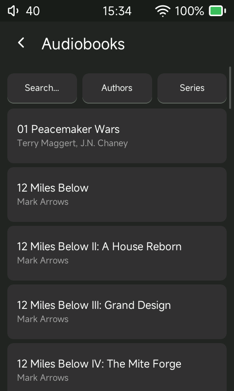
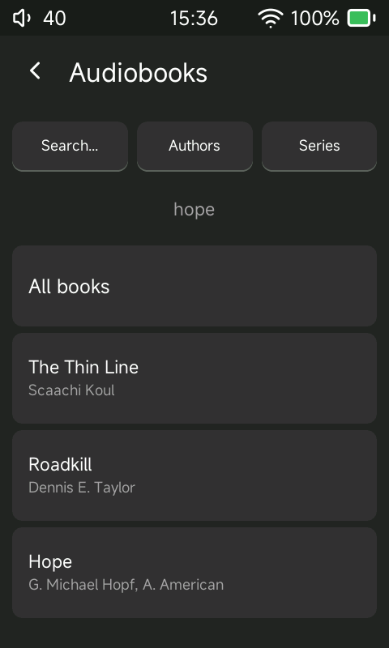

# Audiobookshelf: offline-first listening

Available in Sonix Audiobooks 0.2.0 and later. Not included in 0.1.0.

The R1 remains a standalone player. Download or link a book once, turn Wi-Fi off, and listen locally. A server connection is not required for playback, chapters, bookmarks or resume. When you choose to turn Wi-Fi on again, saved progress is reconciled automatically with Audiobookshelf. Sync never enables Wi-Fi itself and does not automatically download new books.

## Find a book on the server

Starting with **0.3.0**, open **Streaming > Audiobookshelf**, choose your server library, then use the toolbar:

- **Search** opens the keyboard. Enter a query and tap the magnifying-glass key to submit. This searches the whole server library, not just the visible page. Matching follows the server's search behavior, so results can match metadata beyond the title. At most 40 books are shown; refine the query if the limit notice appears.
- **Authors** opens an alphabetical author list. Select an author to see their books by title.
- **Series** opens an alphabetical series list. Select a series to see its books in series sequence.
- Group lists and ordinary/filtered book lists have 40-entry pages. Use the page controls to continue browsing.
- **Back** returns from an author's or series' books to that group list. **All books** clears a search or filter; submitting an empty search also returns to all books.

Wi-Fi and a reachable configured server are required for this browser. It does not change the local Audiobooks views, and finding a book does not automatically download it. Author spelling, series membership and sequence come from your server's metadata; this interface does not merge duplicate author spellings.

| Library controls | Search results |
| --- | --- |
|  |  |

## Which books sync?

Books downloaded through Streaming > Audiobookshelf are linked. An existing SD-card copy must first be linked through that server library; a matching title alone does not enable sync. Local-only books continue to remember their position on the R1 without sending it anywhere.

## Now Playing indicator

The compact, centered status above the artwork identifies the current audiobook:

| Status | Meaning |
| --- | --- |
| Local book: not linked | Resume is local to this R1/card. |
| Checking link | The background worker is resolving this book's link. |
| Linked / upload pending | A link exists; the saved checkpoint has not yet been acknowledged by the server. |
| Waiting for Wi-Fi | The book is linked and has unacknowledged local progress. Keep listening offline. |
| Syncing | A progress upload is in flight. |
| Synced | The server acknowledged the latest **saved checkpoint**, not necessarily the fraction of a second currently playing. |
| Synced (offline) | That checkpoint was acknowledged previously; Wi-Fi is now off. Further listening will create pending progress. |
| Retry pending | The server or link could not be used. The local resume remains saved; online retries are automatic. Check Wi-Fi, the server address/token, and the link if this persists. |
| Other server / setup needed | The saved link cannot be used with the current server configuration. |

The indicator is hidden for music. Its label reads a small in-memory snapshot; it does not do HTTP or read the SD card on the UI thread.

## Offline behavior and timing

- Normal local checkpoints are saved about every 10 seconds while position changes. Pause, seek/stop transitions and normal shutdown flush deliberate checkpoints. Sudden power loss can still lose the interval since the last successful save.
- Switching between several linked books does not replace a single pending RAM slot. Each book's saved position remains available for upload.
- A backward seek is a new position: 61 minutes -> 5 minutes resumes and uploads 5 minutes, not the furthest position reached.
- Failed uploads leave the saved checkpoint pending. Reboot does not discard it. A deleted or unavailable card cannot provide its pending checkpoints until it is inserted again.
- With Wi-Fi off, the worker sleeps until a local checkpoint/status request or a Wi-Fi-change notification. It makes no HTTP attempts and has no periodic retry timer in that state.
- With Wi-Fi enabled, background checks run roughly every 15 seconds. Pending attempts for a book are spaced about a minute apart; pause/stop can request an earlier attempt. Already-synced linked books are checked about every five minutes, and sooner on reconnect, so phone progress can arrive even without further R1 listening. Requests run serially, up to eight books per pass. Network association and server response time can add delay. The Wi-Fi toggle is not proof of server reachability: a verified server response is required before showing Synced.
- These checks are independent of having the audiobook page open. No directory rescan, audio decoding or list allocation is needed to find pending saved checkpoints.

## Scope and conflicts

Progress is reconciled in both directions for linked books:

1. With plausible clocks, the **newest progress timestamp wins**. The R1 timestamps the saved listening checkpoint, not its later upload. Audiobookshelf supplies `lastUpdate`. A newer intentional rewind beats an older position farther through the book.
2. If timestamps are missing, unreliable, or identical with different positions, the **farther position through the whole book wins**. Completed counts as the end. Multipart files are compared using combined elapsed time, then mapped back to the correct local file and offset. This fallback can discard an intentional rewind when its timestamp cannot be trusted.
3. Incoming progress does not interrupt a book that is actively playing. It is retried after pausing. For a loaded, paused book, the saved resume is updated without starting audio; pressing Play loads the imported file/position. Until then the paused decoder may still display its previous position. A deliberate seek cancels that pending resume.

The clock checks use UTC epoch milliseconds, not the displayed timezone. An unset date (before 2020), a progress timestamp more than five minutes into the server's future, an R1 clock over five minutes away from the HTTP `Date` header, or a missing server date triggers the distance fallback. These are plausibility checks, not proof of historical clock accuracy: a modest past clock error may be undetectable after the clock is corrected. If a bad clock prevents HTTPS from connecting at all, the local checkpoint stays pending until connectivity is restored.

The worker reads server progress again immediately before uploading and verifies the saved result afterwards. The current Audiobookshelf API does not offer an atomic conditional progress update; another device writing in the short interval between that final read and the write is still a possible race. Avoid simultaneous live listening on two devices when exact conflict ordering matters. Invalid or unmappable server responses never discard a local checkpoint.

When the fallback selects an upload whose timestamp cannot be trusted, it omits that timestamp and lets Audiobookshelf timestamp the resolution. When an imported timestamp cannot be trusted, it is retained as unknown rather than inventing a listening date.

New manifests record the server address. Older manifests without a server field are adopted against the configured server for compatibility. Re-link after changing server/account; server-address isolation is not account-identity discovery.

Only the progress position/completion state is synced. Local manual bookmarks and settings do not become Audiobookshelf bookmarks/settings.

## Implementation and validation

`AUDIOBOOK_TABLE` remains the source of local resume truth. A small `AUDIOBOOK_ABS_SYNC` table in the same card's `.local/audiobooks.db` records the last server-acknowledged file, offset and completion state. Differences are the durable pending-upload queue. A scan does not discard this acknowledgement table, and no token is stored in it.

HTTP runs outside the database lock. The acknowledgement records the snapshot actually sent; if local playback moves while the request is in flight, the newer checkpoint remains pending. Millisecond event times and revision counters survive rescans. Imports compare the exact pre-request revision and reject queued or concurrent local edits; the resume, completion state and acknowledgement update together in one transaction. Database generation checks reject responses belonging to an earlier card/catalog generation.

API behavior was checked against the [Audiobookshelf progress model](https://github.com/advplyr/audiobookshelf/blob/3563d49424d50170324de9236a24c591b6d965e9/server/models/MediaProgress.js) and [MeController](https://github.com/advplyr/audiobookshelf/blob/3563d49424d50170324de9236a24c591b6d965e9/server/controllers/MeController.js), revision `3563d49424d50170324de9236a24c591b6d965e9`. The old documented `sync-local-progress` route is no longer in that server router; the client uses GET/PATCH `/api/me/progress/<item>` instead.

Host validation includes an HTTP 503 outage followed by a player restart: the checkpoint uploads after recovery without resuming playback. Sanitizer-backed tests cover multiple books, restart, backward seek, old-response races, completion and replacement-card/server isolation. Actual R1 validation is recorded alongside the candidate artifacts in `build/abs-offline-validation/`.

The conflict simulator additionally verifies newer local rewinds, newer remote multipart rewinds, paused-position preservation, physical Play loading the imported part, missing timestamps, a future R1 timestamp, and equal timestamps with different positions. See `SONIX_ABS_CONFLICTS=1 tools/audiobookshelf-host-smoke.sh`. The R1 results below refer to the earlier offline-queue candidate, not proof of the subsequent conflict-resolution changes.

### R1 validation, October 1, 2026

Installed development candidate `011020261247` using the normal SD firmware update after verifying the staged image checksum. The installed executable matched the built executable.

- With Wi-Fi disabled, paused Beyond Exile at 876.600 seconds (14:36). Its previous server acknowledgement remained at 861.182 seconds, and Now Playing displayed "waiting for Wi-Fi".
- Enabled Wi-Fi without resuming playback. The initial request failed during network association; the saved checkpoint remained pending. Automatic retry acknowledged 876.600 seconds and the indicator changed to "synced".
- Disabled Wi-Fi again. The indicator changed to "synced (offline)" while the book remained paused. The player process did not restart during this test.
- Observed approximately 21 MiB resident memory and 27 threads before/after reconnection. This short test is not a battery-life benchmark or a long-duration leak test. Restart persistence was tested on the host, not by another R1 reboot during this sequence.

Candidate firmware SHA-256: `e05844dc88b1fe9223f3b319dc4e705b0724ab462363684fedbadc2944b9ff01`.

Installed player SHA-256: `beac901ecf002f5a5c1198f54b527cd09326ae9e394aa3f070a56bce1a2e3732`.

### Conflict-resolution candidate, October 1, 2026

Installed candidate `011020261330` through the normal update UI after checksum verification. ADB returned automatically and the installed executable matched the build. Database migration preserved all three existing linked books and left legacy event timestamps unknown rather than inventing dates.

- Host and MIPS builds passed the target ABI check. Sanitizer-backed decision/database tests, conflict simulator, existing-copy linking/upload, and outage/restart tests passed. Restart tests now enable Remember Track; startup uses the per-book checkpoint rather than a stale generic playback record.
- On the R1, resumed Beyond Exile offline, paused at 884.587 seconds (14:44), and confirmed that the new checkpoint was pending while Wi-Fi was off.
- Enabled Wi-Fi without resuming playback. Server acknowledgement matched local revision 2, position 884.587 seconds, and listening timestamp `1790879761721` exactly. The status showed Synced; all three linked books had no sync error.
- The player PID stayed unchanged through this listening/reconnect test, with 21,224 KiB resident memory and 27 threads at the final check. Left the player paused with Wi-Fi disabled. This is a short sanity check, not a long-duration stability or battery benchmark.
- Timestamp conflicts were exercised against the simulator fixture, not by fabricating progress on the user's real server. Artifacts/logs are under `build/abs-conflict-validation/`.

Firmware SHA-256: `043646ab43429d41fcd5ca4a15053aa4e0da1cc94736ea5b16b9fc195872af14`.

Installed player SHA-256: `5460c6a71fff6ff3a49f8521474e2366c55380198398e8b7593a5fc2f458fbab`.

### Public 0.2.0 packaging and status-layout check

Build `011020261348` adds only content-sized, centered layout for the status label to the conflict-resolution candidate. Host/target builds and the outage/restart smoke passed again. The exact packaged executable was verified on the R1 after updating, and the long "waiting for Wi-Fi" label was visually checked on the device with the book paused. Its background now fits the text plus five-pixel padding; longer translations wrap within the space between the side controls.

Public `r1.upt` SHA-256: `c0a1f23971497be584965a9cbd52a7783b920f6d3c63c5de426124ce61d6b390` (49,418,240 bytes).

Installed player SHA-256: `8474e7f90ff6afa2280d4efe2361fdf9b5ac34a9310becbd626e2890b042d739`.
